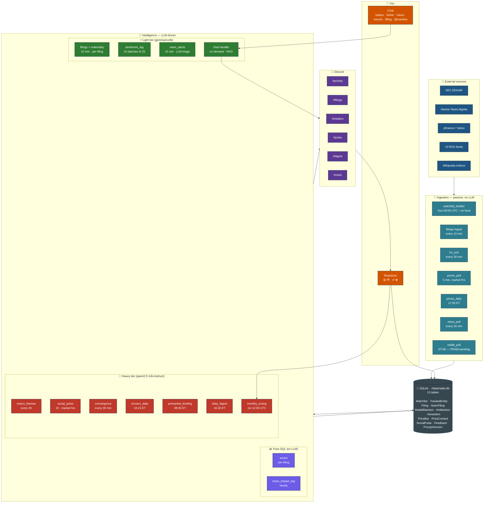
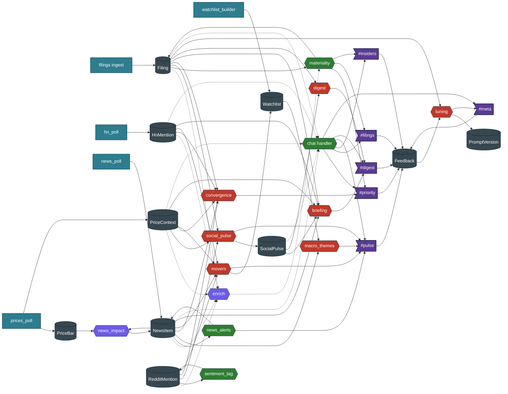
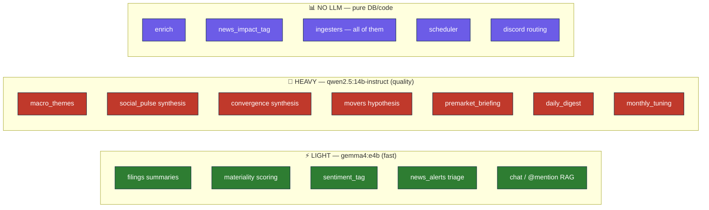
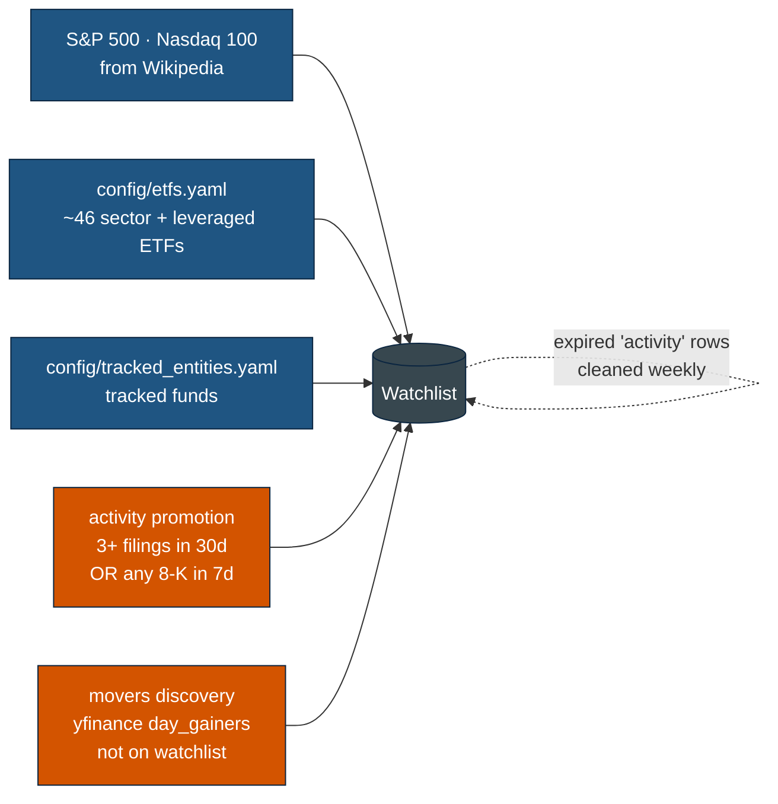
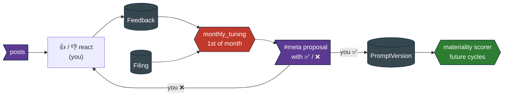

# Sentinel — Architecture

Visual reference of how the bot is wired together as of the news-alerts addition.

Three-layer architecture sharing a single SQLite database:

1. **Ingestion** — passive, scheduled, zero LLM. Each source writes to its own tables.
2. **Intelligence** — LLM-driven pipelines that read ingestion tables and produce derived data.
3. **Surface** — Discord, six channels. User interacts with reactions and chat.

The agentic feel is a function of scheduling + accumulation, not any single LLM having autonomy.

---

## 1. Layered overview



---

## 2. Detailed data flow

What reads what, what writes what. Solid arrows = primary data flow; dashed = LLM call; dotted = enrichment context.



---

## 3. Discord channel routing

Where each post type lands and what reactions it accepts:

| Producer | Channel | Mention | Reactions used |
|---|---|---|---|
| filings ⟶ score 3 (non-insider) | `#priority` | `@you` | 👍/👎 → feedback |
| filings ⟶ score 2 (non-insider) | `#filings` | — | 👍/👎 → feedback |
| filings ⟶ Form 4 / 13F score≥2 | `#insiders` | — | 👍/👎 → feedback |
| filings ⟶ score 0-1 | (DB only, no post) | — | — |
| `social_pulse` spike | `#pulse` | — | 👍/👎 |
| `macro_themes` themes | `#pulse` | — | 👍/👎 |
| `news_alerts` 🚨 alert | `#pulse` | — | 👍/👎 |
| `movers` daily | `#pulse` | — | 👍/👎 |
| `convergence` 🎯 | `#priority` | `@you` | 👍/👎 |
| `premarket_briefing` 🌅 | `#digest` | — | 👍/👎 |
| `daily_digest` 📊 | `#digest` | — | 👍/👎 |
| `monthly_tuning` proposal | `#meta` | — | ✅ apply / ❌ reject |
| Pipeline errors | `#meta` | — | — |
| Chat replies (you ⟶ bot) | same channel as your message | — | — |

---

## 4. Scheduler cadence

17 jobs total. UTC unless noted.

| Job | Trigger | Frequency | Tier | What it does |
|---|---|---|---|---|
| `filings_cycle` | interval | 10 min | light | New filings → summarize + score + route |
| `reddit_poll` | interval | 15 min | none | **STUB** — PRAW pending |
| `hn_poll` | interval | 30 min | none | Algolia search per ticker/company |
| `prices_poll` | interval | 5 min | none | 1-min bars during market hours |
| `prices_daily` | cron | 17:00 ET | none | 30d daily bar refresh |
| `news_poll` | interval | 20 min | none | RSS + yfinance per-ticker |
| `news_alerts` | interval | 15 min | light | LLM triage tier-1 fresh news |
| `news_impact_tag` | interval | 1h | none | Measure realized 1h/1d return per news item |
| `sentiment_tag` | interval | 1h | light | Tag RedditMention rows |
| `social_pulse` | interval | 1h (mkt) | heavy | Spike detection + LLM synthesis |
| `convergence` | interval | 30 min | heavy | 2+ signal alignment per ticker |
| `macro_themes` | interval | 4h | heavy | Cluster macro headlines into themes |
| `movers_daily` | cron | 16:15 ET | heavy | Top % movers without filing trigger |
| `premarket_briefing` | cron | 08:30 ET | heavy | Overnight synthesis |
| `daily_digest` | cron | 16:30 ET | heavy | End-of-day digest |
| `watchlist_rebuild` | cron | Sun 06:00 UTC | none | S&P 500 + Nasdaq 100 + ETFs + activity |
| `monthly_tuning` | cron | 1st 12:00 UTC | heavy | Propose materiality prompt delta |

---

## 5. LLM tier assignment



Sampling defaults (auto-selected on model tag prefix):
- Gemma: `temperature=1.0, top_p=0.95, top_k=64`
- Qwen3: `temperature=0.7, top_p=0.8, top_k=20, min_p=0` (plus `/no_think` injection for JSON mode)

---

## 6. Discovery loop

How the watchlist self-expands beyond the seed indices:



Future: social-mention discovery when Reddit is wired (any unseen cashtag crossing a mention threshold → promote).

---

## 7. Feedback loop

How 👍 / 👎 close back into the prompt:



---

## 8. File map

```
sentinel/
├── config/
│   ├── indices.yaml          # which indices the watchlist pulls
│   ├── etfs.yaml             # curated ETF list
│   ├── tracked_entities.yaml # funds/insiders by CIK
│   ├── subreddits.yaml       # for when Reddit comes online
│   └── news_feeds.yaml       # 13 RSS feeds (macro + tier-1 + Google News topics)
├── data/
│   └── radar.db              # SQLite, WAL mode
├── docs/
│   ├── SPEC.md               # original spec
│   └── ARCHITECTURE.md       # this file
├── src/sentinel/
│   ├── main.py               # entry point, --run-once registry
│   ├── config.py             # pydantic-settings Settings
│   ├── db.py                 # engine + session_scope + inline migrations
│   ├── models.py             # all 13 SQLModel tables
│   ├── llm.py                # Ollama wrapper, family-aware sampling, parse_json_response
│   ├── prompts.py            # all SPEC §8 prompts + seed_prompts
│   ├── discord_client.py     # bot, post_filing, post_meta, post_digest, post_pulse, run_with_bot
│   ├── chat.py               # !commands + @mention RAG
│   ├── feedback.py           # on_raw_reaction_add (filings feedback + tuning apply/reject)
│   ├── scheduler.py          # 17-job AsyncIOScheduler
│   ├── utils.py              # extract_tickers (cashtag/bare/blocklist rules)
│   ├── edgar/
│   │   ├── client.py         # EDGAR HTTP w/ 8 req/s limiter, company_tickers, submissions
│   │   └── watchlist_builder.py
│   ├── ingesters/
│   │   ├── reddit.py         # STUB — PRAW pending
│   │   ├── hackernews.py     # Algolia search per ticker/company
│   │   ├── news.py           # RSS + yfinance per-ticker
│   │   └── prices.py         # yfinance + market-hours guard
│   └── pipelines/
│       ├── filings.py        # summarize + materiality + route
│       ├── enrich.py         # pure DB → EnrichmentContext (filings + chat + materiality)
│       ├── sentiment.py      # batched LLM tagging of RedditMention
│       ├── social_pulse.py   # spike detection + heavy synthesis
│       ├── convergence.py    # 2+ signal stacking → #priority
│       ├── movers.py         # PriceContext outliers + day_gainers discovery
│       ├── macro_themes.py   # cluster macro headlines → themes (with validator)
│       ├── news_alerts.py    # LLM-triaged tier-1 breaking news
│       ├── news_impact.py    # measure realized 1h/1d return per news item
│       ├── briefing.py       # pre-market briefing
│       ├── digest.py         # end-of-day digest
│       └── tuning.py         # monthly feedback-driven prompt delta
└── tests/
    ├── test_ticker_extraction.py   # 12 cases — passing
    ├── test_prompts.py             # 8 cases — passing
    ├── test_edgar.py               # placeholder
    └── test_materiality.py         # placeholder
```

---

## 9. Non-goals (worth restating)

Per SPEC §12, the bot does **not** do any of the following, even though they might seem tempting:

- Auto-trading, broker integration, position sizing
- Price prediction or signal generation
- Backtesting framework
- Multi-user, ACLs, web dashboard
- X/Twitter integration, Discord-scraping of other servers
- Paid news APIs (Bloomberg, Reuters paid)
- LLM-speculation discovery of "related" tickers
- Slash commands for portfolio management

The bot's role is **information surfacing + correlation + RAG**, not decision-making. The edge comes from:

1. **Breadth** — ~600 names + ETFs continuously monitored.
2. **Speed** — sub-10-min latency on SEC filings.
3. **Cross-source synthesis** — filings × price × HN × news × Reddit (when wired).
4. **Measurement** — every news item gets tagged with realized price reaction.
5. **Adaptation** — 👍/👎 feedback → monthly prompt-tuning loop.

You bring the trading judgment; the bot keeps you informed without you having to refresh anything.
