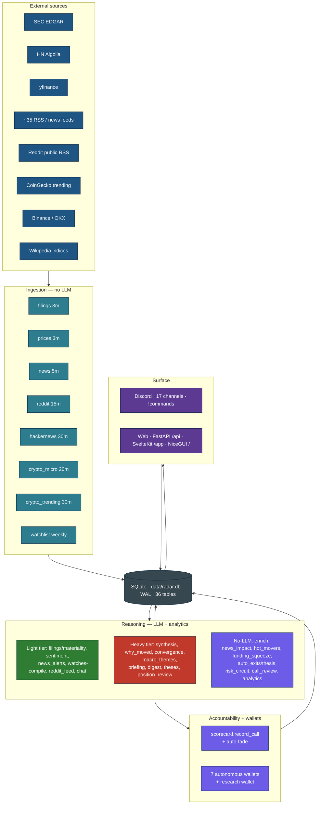
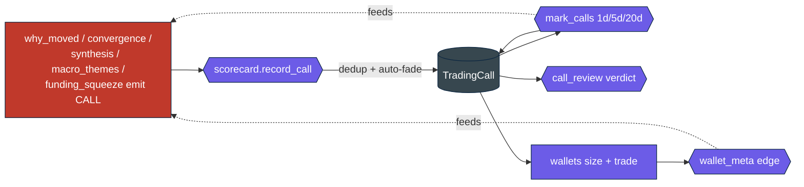

# Sentinel — Architecture

How the system is wired together, as of June 2026. This is the "what reads what,
what writes what, what runs when" reference. For feature-level detail and usage
see `HANDBOOK.md`; for code conventions see `../CLAUDE.md`.

Sentinel is a single Python process (`python -m sentinel.main`) running four
cooperating subsystems on one asyncio event loop, sharing one SQLite database:

1. **Ingestion** — passive, scheduled, zero-LLM collectors. Each source writes
   its own tables. One source failing never blocks another.
2. **Reasoning** — LLM + analytic pipelines that read ingestion tables and
   produce derived data (summaries, scores, calls, narratives, digests).
3. **Accountability + wallets** — every directional call is logged, marked to
   market, graded, auto-faded, and traded by autonomous paper wallets.
4. **Surface** — a Discord bot (channels + `!commands`) and an in-process web
   dashboard (FastAPI `/api` + SvelteKit `/app` + legacy NiceGUI `/`).

The agentic feel comes from scheduling, routing, and accumulation — not from any
single LLM call having autonomy. The whole thing is a closed loop:

```
ingest → reason → call → trade(paper) → measure → auto-fade → self-monitor
   ^________________________________________________________________|
                (the scorecard feeds the next reason)
```

---

## 1. Process & runtime model

`main.py` boots in this order (`main()` → `_run_live()`):

1. Parse CLI args. Short-circuit modes exit early: `--preflight` (boot checks),
   `--reset` (archive DB to `data/backups/`, recreate schema), `--run-once <job>`.
2. `init_db()` — create all tables, run additive column migrations, seed prompts
   and funds.
3. Unless `--skip-llm`: verify both LLM tiers respond.
4. Unless `--skip-watchlist`: build the watchlist from config + EDGAR.
5. `_run_live()`: start the APScheduler, register the Discord bot + reaction/
   button handlers, mount the in-process web server (FastAPI + NiceGUI + the
   SvelteKit static build) as a uvicorn task on the same loop, then block on the
   Discord client until SIGTERM/SIGINT.

Everything runs in one process on one event loop. Scheduled jobs run off-loop in
worker threads; all blocking DB/LLM work inside async handlers is pushed through
`asyncio.to_thread` so the loop never stalls.

---

## 2. Layered overview



---

## 3. Data model (SQLite, 36 tables)

One SQLite file, `data/radar.db`, in WAL mode (`busy_timeout=60000`,
`synchronous=NORMAL`) so contended writers wait rather than error. New tables
auto-create on boot; new columns are applied as additive `ADD COLUMN` migrations
in `db.py`. DB URL is `SENTINEL_DB_URL` (fallback `FILING_RADAR_DB_URL`,
default `sqlite:///./data/radar.db`). `archive_database()` powers `--reset`:
it moves the DB + WAL/SHM siblings into `data/backups/` and reinitializes empty.

| Group | Tables |
|---|---|
| Universe | `Watchlist`, `TrackedEntity` |
| Filings | `Filing`, `SeenFiling` |
| Social / news | `RedditMention`, `HnMention`, `NewsItem`, `SocialPulse`, `ArticleBody` |
| Market | `PriceBar`, `PriceContext`, `CryptoMicro`, `EarningsDate` |
| User book | `PaperTrade`, `Holding`, `SymbolNote`, `DailyPlan`, `GamePlan` |
| Wallets | `Fund`, `FundTrade`, `FundEquity` |
| Accountability | `TradingCall`, `Thesis`, `ThesisEvent`, `NarrativeEvent` |
| LLM caches | `CallSummary`, `NewsAnalysis`, `RedditAnalysis`, `ResearchTask` |
| Ops / tuning | `Feedback`, `PromptVersion`, `PendingTuning`, `JobRun`, `Briefing`, `Watch`, `ClaimCheck` |

Load-bearing shapes:

- **`Watchlist`** — `cik`, `ticker`, `source` (`index` / `tracked_entity` /
  `activity` / `crypto` / `crypto_trending` / `macro`), `asset_class`
  (`equity` / `crypto` / `future` / `rate`), `expires_at` (TTL for promoted rows).
- **`Filing`** — `accession_number` (unique), `form_type`, `summary`,
  `materiality_score` (0–3), `materiality_reason`, `message_id`, `channel`.
- **`TradingCall`** — the accountability spine: `ticker`, `direction`,
  `conviction` (1–5), `source` (pipeline name), `thesis`, `price_at_call`,
  `ret_1d_pct` / `ret_5d_pct` / `ret_20d_pct`, `settled`, `resolved_posted_at`.
- **`Fund` / `FundTrade` / `FundEquity`** — wallet policy knobs, per-position
  risk fields (`stop_price`, `target_price`, `trailing_stop_pct`,
  `watermark_price`), and the equity curve.
- **`Thesis` / `ThesisEvent`** — running hypotheses with `state`
  (`active` / `validated` / `invalidated` / `matured` / `closed`) and linked
  supporting/challenging events.
- **`PromptVersion`** — versioned prompts; `get_prompt(name)` returns the active
  DB row or falls back to the code constant.

---

## 4. Ingestion layer

Each ingester runs on its scheduler interval, off-loop, with a top-level catch
that posts errors to `#meta`. Per-item failures are skipped, never fatal.

| Ingester | Source | Writes | Key behaviors |
|---|---|---|---|
| `filings` | EDGAR `getcurrent` Atom feed → per-CIK `submissions.json` | `Filing`, `SeenFiling` | 8 req/s limiter; one cheap global probe then deep-fetch; docs stripped to text, truncated ~100k chars |
| `reddit` | Public Reddit `/r/<sub>/new/.rss` + Google-News fallback | `RedditMention` | 4-UA rotation; 403 circuit breaker (5 strikes → 20-min cooldown → gnews-only); lazy top-comment enrichment |
| `hackernews` | HN Algolia search (6h lookback) | `HnMention` | whole-word ticker / company-name match; short tickers (≤2 char) only via company name |
| `news` | ~35 RSS/Google-News feeds + yfinance per-ticker | `NewsItem` | canonical-URL dedup (24h); `is_macro` tag from feed; LLM ticker tagging (≤40 calls/poll) validated against watchlist |
| `prices` (intraday) | yfinance 1m bars | `PriceBar`, `PriceContext` | NYSE-hours gated (crypto/futures 24/7); bulk `INSERT … ON CONFLICT`; dead-ticker auto-prune after 3 empty cycles |
| `prices` (daily / backfill) | yfinance daily / multi-year | `PriceBar` | 17:00 ET daily refresh; 6h backfill; first-seen tickers get long history |
| `crypto_micro` | Binance (primary) / OKX (fallback) | `CryptoMicro` | funding rate, OI + 24h drift, orderbook imbalance; geo-block failover; 90-min staleness gate |
| `crypto_trending` | CoinGecko trending (free) | `Watchlist` | verify-before-promote via `can_price()`; 14-day TTL then auto-expire |

**Watchlist construction** (`edgar/watchlist_builder.py`, weekly + on boot):
S&P 500 + Nasdaq 100 (Wikipedia) → tickers resolved to CIKs → plus
`config/etfs.yaml`, `config/crypto.yaml`, `config/macro_assets.yaml`, and the
`config/tracked_entities.yaml` 13F filers (CIK-verified against EDGAR). **Activity
promotion** adds any CIK with ≥3 filings in 30 days or any 8-K in 7 days (60-day
TTL). Crypto/macro instruments get synthetic CIKs. Net universe ≈ 700+ names.

**Ticker extraction** (`utils.py`): `$cashtag` or bare ticker or company-name
alias, each gated by watchlist membership and a 54-word common-English blocklist;
bare tickers also need a corroborating signal (repeat, flair, cashtag in title,
or financial-context cue). News articles add an LLM tagging pass on top, always
validated back against the watchlist.

---

## 5. Reasoning layer (pipelines)

`pipelines/` holds ~25 processors. "Calls?" = emits a scored `TradingCall`.

| Pipeline | Purpose | Tier | Calls? | Channel |
|---|---|---|---|---|
| `filings` | summarize + score materiality of each filing, route by score | light | — | filings / insiders / priority |
| `enrich` | pure-DB context (Reddit/HN/news counts + price) for materiality | none | — | (internal) |
| `why_moved` | explain an unexplained price/volume move, then commit a forward read | heavy | ✅ | priority / crypto |
| `convergence` | stack filing + social + price + news on one name → a call | heavy | ✅ | convergence / priority |
| `synthesis` | the "octopus": system-wide connected read, every 6h, reads its own track record | heavy | ✅ | news / pulse |
| `macro_themes` | macro desk: news → transmission chain → exposed names → committed read | heavy | ✅ | macro / news |
| `funding_squeeze` | crypto funding/OI/orderbook squeeze setups | none | ✅ | crypto / news |
| `social_pulse` | tickers with abnormal Reddit volume + substance/noise judgment | heavy | — | pulse |
| `sentiment` | tag recent Reddit mentions bullish/bearish/thesis | light | — | (db) |
| `movers` | EOD biggest movers + one-line hypothesis + wider-universe discovery | heavy | — | pulse |
| `hot_movers` | terse "what's moving NOW" on volume, no narrative | none | — | hot |
| `news_alerts` | breaking tier-1 news triage with importance | light | — | news / pulse |
| `news_impact` | measure realized 1h/1d return per news item | none | — | (db) |
| `briefing` | pre-market positioned take | heavy | — | digest |
| `digest` | end-of-day narrative + "the read" | heavy | — | digest |
| `catalysts` | forward calendar (OPEX/FOMC/CPI + persisted earnings) | none | — | catalysts / digest |
| `lounge` | off-clock #general geopolitics↔market chain, gated `SKIP` | light | — | general |
| `watches` | compile NL alerts to a constrained spec, evaluate each cycle | light (compile) | — | priority / news |
| `reddit_feed` | LLM-curated stream of genuinely notable r/ posts | light | — | reddit |
| `book_risk` | proactive risk scan of your open paper positions | light | — | risk / priority |
| `position_review` | pre-market hold/trim/close verdicts on open positions | heavy | — | (narrative / SSE) |
| `call_review` | post the deterministic verdict on matured calls | none | — | calls / digest |
| `tuning` | monthly: rewrite the materiality prompt from 👍/👎 feedback | heavy | — | meta |
| `auto_exits` | enforce user stops/targets/trailing stops | none | — | (SSE) |
| `auto_thesis` | promote 5/5-conviction calls into theses | none | — | (narrative) |
| `auto_research_pre_earnings` | queue research tasks ahead of earnings | heavy | — | (SSE) |
| `risk_circuit` | pause new opens when a wallet draws down ≥15% | none | — | (narrative) |
| `game_plan` | fuse risk + maturing + catalysts + fresh ideas into one ranked morning action list | heavy | — | (web `/api/plan/gameplan`) |

**Filings flow:** discover (one EDGAR `getcurrent` probe) → cheap triage score on
a raw excerpt → if ≥2, full form-typed summary + re-score with enrichment →
route. Form type selects both prompt and model (`8-K`/`4`/`424B`/generic → light;
`10-Q`/`10-K`/`13F`/`S-1`/`DEF 14A` → heavy). Routing: insider forms (4, 13F) to
`#insiders` at score ≥2; others to `#priority` (3) or `#filings` (2); 0–1 stored
but not posted.

**Synthesis ("octopus"):** every `SYNTHESIS_HOURS` (default 6) it pulls a
system-wide snapshot — holdings + open fund positions, material filings, social
pulses, per-asset movers, macro/market-moving news with measured impact, earnings
window, the track-record brief, and wallet edge — plus its own last two reads and
how the calls it made since then resolved. The model writes an *update*, not a
cold take, and may emit calls.

---

## 6. Accountability spine



Every directional call funnels through `scorecard.record_call`. It de-dupes a
re-emitted standing idea, applies **auto-fade** (over ≥12 scored calls in a 90-day
window, a source with measured negative hit-rate gets conviction mechanically cut
— −1 at 40–45% HR, −2 at 33–40%, hard fade below 33%, floored at 1, never
inflated), and stores a `TradingCall` with the price at call time. Because
conviction lives on the call, the fade automatically shrinks fund position size,
can drop a call below a wallet's `min_conviction` gate, lowers `call_review`
notability, and rebuckets `wallet_meta` — nothing else needs changing. `mark_calls`
fills 1d/5d/20d returns from `PriceBar` history; an unscoreable call (no/stale
price) retires *unscored* rather than getting a fabricated grade.

**Fact verification (`verify.py`).** The "never fabricate" rule is *enforced*,
not just discouraged by the grounding preamble. Inside `record_call` — before
the `TradingCall` is persisted — the thesis is run through `verify.verify_text`:
a light-LLM extractor pulls the hard, ticker-bound figures (last price, 1d/5d
move, volume multiple, up/down direction) and a deterministic `check_claims`
compares each to the `PriceContext` row within configurable tolerances
(`VERIFY_*`). A contradiction is **annotated, never blocking**: the call is
always recorded, but stamped `grounded=False`, conviction floored to 1, the
thesis tagged `⚠ unverified figure`, and a one-line `#meta` alert fired. Every
run that examined real figures writes a `ClaimCheck` row (the audit trail behind
the `/system` grounding panel) and publishes a `claim_check` SSE event. Fully
**fail-open**: a disabled flag, an unavailable extractor, or any exception
leaves the call *unverified* (`grounded=None`), never dropped. The identical
check runs on outbound embeds at the `post_embed` chokepoint (§7).

**Autonomous wallets** (`funds.py`, `_POLICIES`): seven paper accounts trade the
same call stream under deterministic policies, $10,000 each, no LLM in the trade
loop — degen 🦍, catalyst 🎯, macro 🌐, crypto 🪙, sniper 🔭, **leaders 📈**
(trend-aligned momentum; replaced the retired contrarian), hype 🚀 — plus a
user-directed **research 🔬** wallet. All symmetric long/short, no leverage,
2-day earnings blackout, sized by fixed-risk with a conviction/edge multiplier.
`wallet_meta` reads realized P&L by source/conviction/asset and refuses to call an
edge real below its minimum closed-trade sample. The degen-vs-leaders-vs-hype
triangle is a designed hypothesis test (does the momentum signal have edge, and
does trend/crowd confirmation sharpen it).

---

## 7. Surface layer

### Discord

17 channels, grouped as raw-ish streams (`#filings`, `#insiders`, `#news`,
`#macro`, `#crypto`, `#reddit`, `#pulse`), curated reasoning (`#priority`,
`#convergence`, `#hot`, `#calls`, `#risk`, `#funds`), and daily/system
(`#digest`, `#catalysts`, `#general`, `#meta`). Channel IDs are env-configured;
unset optional channels degrade to a sensible parent (`#reddit` and `#hot` *skip*
instead, to avoid firehosing). `routing.channel_for(ticker, default)` sends a
ticker's content to its asset-class channel (crypto → `#crypto`).

Every post goes through the `discord_client.post_embed` chokepoint: a UTC
timestamp, an importance badge (🔴🟠🟡🔵⚪ for 5→1), an inline **fact-verification**
pass (run off-loop via `asyncio.to_thread` on posts at/above
`VERIFY_MIN_IMPORTANCE` — extracts the embed's hard figures, checks them against
`PriceContext`, appends a `⚠ Unverified figures` field on a contradiction, never
holds the post; see §6), and a persistent
`PostActionsView` with three buttons — **🤖 Ask AI** (opens a thread, seeds a
placeholder, replaces it with an LLM brief, then answers follow-ups on the shared
`chat.answer_question` path), **👍 Useful**, **👎 Noise**. The 👍/👎 feed the
monthly materiality tuner; ✅/❌ reactions on a `#meta` tuning proposal apply or
reject the prompt delta. Users interact via `!commands` and `@mention` (status,
ticker/news/filing lookups, paper trading, holdings, scorecard, calls, funds,
theses, research, watches, timeline, catalysts, health — see HANDBOOK §11).

### Web (in-process, localhost)

The same process serves a web app via uvicorn on the bot's loop (default
`127.0.0.1:8730`):

- **FastAPI `/api`** — ~22 routers (`overview`, `markets`, `symbol`, `crypto`,
  `calls`, `filings`, `news`, `social`, `theses`, `wallets`, `positions`,
  `research`, `watches`, `analytics`, `catalysts`, `copilot`, `plan`, `prompts`,
  `health`, `lookup`, `market-status`, `events`). It reads through the same WAL
  engine and shares accessors with the Discord bot — one voice, no forked logic.
  `/api/events` is a Server-Sent-Events stream (with `Last-Event-ID` replay) fed
  by the in-process `events.publish` pub/sub, so the UI updates live.
- **SvelteKit `/app`** — the modern UI (Svelte 5 + SvelteKit 2 + Tailwind 4 +
  TanStack Query), built static into `frontend/build/` and mounted by
  `dashboard/v2_serve.py` with SPA fallback. Pages: Overview, Markets,
  Symbol detail, Crypto, Book, Journal, Calls, Intel, Feed, Analytics, Theses,
  Research, Copilot, Lookup, Watches, Portfolio, Compare, Settings, System.
- **NiceGUI `/`** — the original 5k-line in-process cockpit (`dashboard/app.py`),
  still mounted at root. The swap to make SvelteKit primary is planned but not yet
  flipped; both run on the same FastAPI app today.

The `analytics/` package (19 read-only modules: attribution, calibration,
concentration, correlation, volatility, streaks, perf-by-source, pnl-distribution,
risk-monitor, earnings-exposure, holdings-news, daily/monthly, hot, converging,
sentiment-quality, digest, dedupe) computes the numbers behind the dashboard and
chat. A dashboard mount failure logs and the bot runs on.

---

## 8. LLM stack

Two logical tiers, **light** and **heavy**, each resolvable to a local Ollama
model or a remote OpenAI-compatible API independently (`llm.py`, `config.py`):

- **Code defaults:** light `gemma4:e4b`, heavy `qwen3:30b-a3b` (local Ollama).
- **This deployment's `.env`:** both tiers route to `deepseek/deepseek-v4-flash`
  via OpenRouter (`gmicloud/fp8`), with local `qwen2.5:14b-instruct` as the Ollama
  heavy fallback. So the configured defaults and the running config can differ —
  read `.env` to know what a given box is actually using.
- **Reasoning level** (`LLM_REASONING`, default `medium`) controls hidden
  chain-of-thought; JSON/structured calls always force reasoning off. Heavy calls
  can `fallback_light` on failure.
- Retry is tenacity (3 attempts, exponential backoff) on connect/timeout errors;
  a defensive `parse_json_response` strips fences and salvages object-vs-array
  mismatches. Token + cost are tracked per process (`llm_stats`), priced via
  `LLM_PRICE_IN_PER_M` / `LLM_PRICE_OUT_PER_M`. A grounding preamble
  (`grounding.py` + `config/world_anchor.yaml`) corrects training-cutoff bias.

---

## 9. Scheduler cadence (44 jobs)

`scheduler.py` registers 44 APScheduler jobs (intervals jittered ±45s to avoid
SQLite lock contention). Every scheduled job is also runnable as
`--run-once <name>` for single-cycle debugging (the sole exception is the weekly
watchlist rebuild, a sync bootstrap step). Cadences are env-tunable
(`POLL_*_MINUTES`, `SYNTHESIS_HOURS`, `*_HOUR_ET`, …).

| Cadence | Jobs |
|---|---|
| 3 min | `filings_cycle`, `prices_poll` |
| 5 min | `news_poll`, `auto_exits` |
| 10 min | `news_alerts` |
| 15 min | `reddit_poll`, `hot_movers`, `watches`, `auto_thesis`, `risk_circuit` |
| 20 min | `crypto_micro`, `funding_squeeze`, `reddit_feed` |
| 30 min | `hn_poll`, `crypto_trending`, `convergence`, `why_moved`, `book_risk` |
| 1 h | `sentiment_tag`, `social_pulse`, `news_impact_tag` |
| 2 h | `mark_calls`, `call_review` |
| 4 h | `macro_themes` |
| 6 h (default) | `synthesis`, `prices_backfill` |
| Cron (ET) | `catalyst_radar` 07:00, `auto_research_pre_earnings` 07:30, `health_post` 08:00, `position_review` 08:00, `thesis_generate` 08:15, `premarket_briefing` 08:30, `game_plan` 08:45 (mon-fri), `lounge_am` 11:20, `movers_daily` 16:15, `daily_digest` 16:30, `funds_digest` 16:45, `thesis_review` 17:10, `lounge_pm` 17:20, `prices_daily` 17:00 |
| Cron (other) | `funds_cycle` hourly, `funds_meta` Sun 12:00 ET, `watchlist_rebuild` Sun 06:00 UTC, `monthly_tuning` 1st 12:00 UTC |

Market-hours gating is explicit only in `hot_movers` (and the price/crypto
ingesters); other jobs run 24/7 but their cadences align with market timing.

---

## 10. Where things live

| Concern | File |
|---|---|
| Orchestration / cadences | `scheduler.py` |
| Entrypoint, `--run-once`, `--reset`, `--preflight` | `main.py`, `preflight.py` |
| Data model / DB engine / migrations | `models.py`, `db.py` |
| Settings + env | `config.py`, `.env.example` |
| LLM wrapper / tiers / tools | `llm.py`, `llm_tools.py`, `llm_tool_log.py` |
| Accountability + auto-fade | `scorecard.py` |
| Wallets + meta | `funds.py` |
| Theses / per-ticker memory | `thesis.py`, `narrative.py` |
| User paper book / research | `portfolio.py`, `research_desk.py`, `research.py`, `dossier.py` |
| Ingesters | `ingesters/`, `edgar/` |
| Pipelines | `pipelines/` |
| Analytics | `analytics/` |
| Prompts | `prompts.py` |
| Discord surface | `discord_client.py`, `chat.py`, `feedback.py`, `interactions.py`, `ui.py`, `routing.py` |
| Web API | `api/` |
| Web dashboards | `dashboard/` (NiceGUI `app.py`, SvelteKit mount `v2_serve.py`), `frontend/` |
| Tests (~365) | `tests/` |
